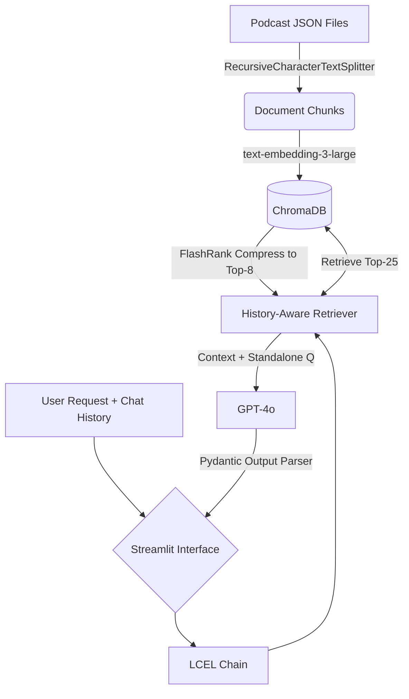

# Hub Health Vir

## 1. Project Description
Hub Health is a RAG (Retrieval-Augmented Generation) chatbot designed to read Andrew Huberman podcast transcripts in JSON format and answer questions with precise citations. 

## 2. Architecture Choices
- **Interface**: Built with Streamlit for a fast and clean chat UI. Sidebar is fully removed for simplicity.
- **Orchestration**: Built using LangChain's LCEL (LangChain Expression Language) for transparent internal operations.
- **Retrieval & Reranking**: Uses `ContextualCompressionRetriever` with `FlashrankRerank` (Top-8) to surface the most relevant chunks out of an initial Top-25 search, alongside `create_history_aware_retriever` for conversational memory.
- **Vector DB**: ChromaDB running locally. It persists embeddings to a folder (`chroma_db`).
- **Embeddings/LLM**: `text-embedding-3-large` and `gpt-4o` from OpenAI to leverage state-of-the-art context window and reasoning.
- **Dependency Management**: Uses `uv` for ultra-fast, modern Python package resolution. Check out `pyproject.toml`.

## 3. Architecture Diagram



## 4. Full Folder Structure

```
├── Makefile             # Automation wrapper
├── pyproject.toml       # Single-source of truth for metadata + deps
├── README.md            # You are here
├── data/                # Transcript JSON files
├── src/
│   └── hub_health/
│       ├── __init__.py
│       ├── app.py       # Streamlit Chatbot interface
│       ├── chain.py     # LCEL Pipeline (Retriever + LLM prompt + Parser)
│       ├── config.py    # `pydantic-settings` to load .env safely
│       ├── ingest.py    # Chunking and embedding logic
│       ├── models.py    # Data models for transcript and LLM response
│       └── retriever.py # Chroma VectorStore wrapper
└── tests/
    ├── smoke/
    │   └── test_smoke.py  # End-to-end integration test
    └── unit/
        ├── test_chain.py
        ├── test_ingest.py
        └── test_retriever.py
```

## 5. Installation & Run Instructions

**Prerequisites:** Assumes `uv` is installed globally (`curl -LsSf https://astral.sh/uv/install.sh | sh`), and `.env` file exists with `OPENAI_API_KEY`.

```bash
# Install all dependencies
make dev

# Start the Streamlit App
make run
```

## 6. Test Summary
- **Unit Tests:** Located in `tests/unit`. These test ingestion splitting logic, retrieval instantiations, and RAG formatting chains.
- **Smoke Tests:** Located in `tests/smoke`. Performs an end-to-end pipeline creation inside an ephemeral database without disrupting prod Chroma.
- Run all checks via: `make ci`, or run tests natively with `make test` and `make smoke`.

## 7. Example Usage
```text
User: What is the relationship between sleep and learning?
Agent: Sleep is critical for neuroplasticity and learning... 

Sources: 
- Source 1: Understanding and Using Dreams to Learn (https://www.youtube.com/watch?v=...)
```

## 8. Best Practices for RAG Chatbots

Based on the development of Hub Health, the following best practices should be observed:
- **Conversational Memory**: Implement a history-aware retriever to rewrite user queries based on the chat history. This ensures follow-up questions are accurately context-matched against the vector database.
- **Clear Citation Formatting**: Provide precise and readable citations. Using italicized textual references or named source links (instead of raw index numbers) builds user trust and makes the sources easily verifiable.
- **Zero-Configuration UX**: Conceal background processes from the user. Automate data ingestion and vector store initialization so the app is instantly ready for use upon launch, without requiring manual side-bar operations.
- **Structured Outputs**: Instead of loose text streaming, utilize Pydantic structured outputs via `with_structured_output` to reliably enforce the schema of LLM responses and citations.
- **Advanced Retrieval Options**: Incorporating a two-stage retrieval process with a base retriever (ChromaDB) and a reranker (`FlashrankRerank`) substantially improves the quality of contexts passed to the LLM.
- **Continuous Evaluation**: Routinely test the RAG pipeline using evaluation scripts against golden question-answer pairs to validate retrieval accuracy (faithfulness) and answer relevancy.
- **Separation of Concerns**: Keep ingestion (`ingest.py`), retrieval (`retriever.py`), LLM orchestration (`chain.py`), and the UI (`app.py`) in separate modules for clean architecture and easier unit testing.
