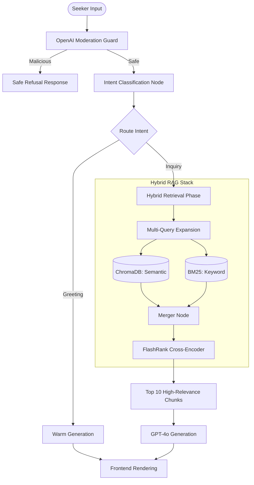

# SAGE: Spiritual Archive Guidance Engine 🕊️

> **"Heart Speaks to Heart in the Sanctuary of Silence."**

SAGE (formerly Heart Speaks) is a state-of-the-art **Retrieval-Augmented Generation (RAG)** ecosystem designed to preserve and provide intelligent access to thousands of spiritual discourses. It transforms a vast archive of 4,600+ PDF transcripts into a living, conversational companion capable of guiding seekers through profound spiritual inquiries with precise citations.

---

## 🌐 Live Production Access

The SAGE Sanctuary is fully deployed and operational:

*   **Sanctum (Frontend):** [https://sage-frontend-34833003999.europe-west2.run.app](https://sage-frontend-34833003999.europe-west2.run.app)
*   **Oracle (Backend API):** [https://sage-backend-34833003999.europe-west2.run.app](https://sage-backend-34833003999.europe-west2.run.app)

---

## 🔐 Registration & Access Workflow

SAGE implements a secure, admin-gated registration process to protect the integrity of the spiritual archives.

1.  **Register**: Visit the [Login page](https://sage-frontend-34833003999.europe-west2.run.app/login) and click **"Register"**. Provide your Name, Email, and **Abhyasi ID**.
2.  **Admin Review**: A notification is automatically dispatched to the administrator.
3.  **Approval**: The administrator reviews pending requests in the **Archive Dashboard** (`/dashboard`) and approves or rejects the seeker.
4.  **Login**: Once approved, log in using your **Email** as the username and **Abhyasi ID** as the password.

---

## ✨ Core Applications

### 1. The Sanctuary — Chat (`/`)
Experience a persona-driven consultation. SAGE listens deeply and responds according to your intent:

| Intent | Persona |
| :--- | :--- |
| **Seeking Wisdom** | Deep, meditative thematic explorations with bold subheadings |
| **Emotional Support** | Compassionate, letter-style guidance — never prescriptive |
| **Factual Reference** | Precise, scholarly citations with exact dates and authors |
| **Exploration** | Structured overviews spanning multiple teachings |
| **Greeting** | Warm, brief conversational welcomes |

Every response includes **expandable citation cards** — click to read the exact whisper the LLM used, and click **"Open PDF"** to view the original source document.

### 2. The Archives — Reader (`/reader`)
A dedicated space for focused, sequential study of the whispers.
*   **Timeline Navigation:** Read chronologically from 1991 to 2017, using "Next" / "Prev" buttons.
*   **Progress Tracking:** SAGE saves exactly where you left off. Return to your precise position anytime.
*   **Auto-Save Notes:** Jot personal reflections as you read — they are saved automatically before navigating to the next message.
*   **Seamless Experience:** The system dynamically skips missing source files, ensuring no broken reading flow.

### 3. Saved Reflections — Bookmarks (`/bookmarks`)
Your personal library of meaningful whispers.
*   **Per-User Isolation:** Your bookmarks and notes are private and securely stored per account.
*   **One-Click PDF Access:** Instantly open the original source document for any saved chunk.
*   **Manage Your Journey:** View or remove reflections as your understanding evolves.

### 4. The Archive Dashboard (`/dashboard`)
A powerful tool for exploratory data analysis and administration.
*   **Statistical Insights:** Visualize the temporal distribution of whispers across decades.
*   **Full-Text Repository Search:** Search across the entire SQLite dataset for specific keywords or author names.
*   **Admin Management (Admins only):** Approve or reject new seeker registrations.
*   **User Roster (Admins only):** View all registered seekers with their status, Abhyasi IDs, and roles.
*   **Chat Logs (Admins only):** Audit every conversation — stored by Session ID, user, question, and response.

---

## 🏗️ Technical Architecture

### Service Interaction Map

```
Browser (Next.js Frontend)
        │
        │ HTTPS REST (JWT Auth)
        ▼
FastAPI Backend (sage-backend / sage-api on Cloud Run)
  ├─ /chat           ──► LangGraph RAG Pipeline
  ├─ /stream         ──► Streaming LangGraph RAG Pipeline
  ├─ /admin/*        ──► Admin Routes (require_admin guard)
  ├─ /reader/*       ──► Reader Progress & Bookmarks
  ├─ /stats          ──► Dashboard Statistics
  └─ /data/*         ──► Static PDF File Serving
        │
        ├─► ChromaDB (Vector Store) — Persistent on disk
        ├─► SQLite messages.db — Full-text metadata + chat logs
        └─► OpenAI API (Embeddings + GPT-4o)
```

### The LangGraph Brain



### RAG Pipeline Deep-Dive

| Stage | Detail |
| :--- | :--- |
| **Ingestion** | PDFs processed via `PyPDFLoader`. Content is MD5-hashed to prevent duplicate ingestion. |
| **Author Extraction** | Author name parsed from structured filenames (`Day_Month_Date_Year_H_M_AMPM_Author.pdf`). Regex fallback scans the last 500 chars of each message. |
| **Chunking** | `RecursiveCharacterTextSplitter`: **1,000 characters** per chunk, **200-character overlap**, split on `\n\n → \n → space`. |
| **Embeddings** | **OpenAI `text-embedding-3-large`** — the highest-quality OpenAI embedding model. |
| **Hybrid Retrieval** | **60% Dense (ChromaDB)** + **40% Sparse (BM25)** — combined via `EnsembleRetriever`. |
| **Query Expansion** | `MultiQueryRetriever` generates 3 semantic paraphrases of the question before retrieval. |
| **Initial Pool** | Top **25 candidates** retrieved from the combined index. |
| **Reranking** | **FlashRank Cross-Encoder** re-scores all 25 candidates against the exact query. Top **10** selected. |
| **Context Injection** | 10 final chunks injected into the LLM system prompt under a `Context:` block. |
| **Output Length** | Naturally scales with number of distinct themes found in the top-10 chunks — no fixed token limit. |

---

## 🚀 Production Infrastructure

Deployed on **Google Cloud Platform (GCP)**:

| Service | Technology | Spec |
| :--- | :--- | :--- |
| **sage-frontend** | Next.js 14 + Tailwind CSS | Cloud Run (Standard) |
| **sage-backend** | FastAPI + LangGraph | Cloud Run (2Gi RAM / 1 vCPU) |
| **sage-api** | FastAPI + LangGraph (mirror) | Cloud Run (2Gi RAM / 1 vCPU) |
| **Vector Store** | ChromaDB (Persistent) | Bundled in container image |
| **Metadata Store** | SQLite (`messages.db`) | Bundled in container image |
| **Secrets** | GCP Secret Manager | JWT Key, OpenAI Key, Gmail SMTP |

---

## 🛠️ Local Development Quickstart

**Prerequisites:** `uv`, `npm`, and an `.env` file with `OPENAI_API_KEY`, `JWT_SECRET_KEY`, and `GMAIL_APP_PASSWORD`.

```bash
# 1. Clone and install
git clone https://github.com/vaibhavd030/Heart_speaks.git
cd Heart_speaks
make install
cd frontend && npm install && cd ..

# 2. Ingest data (first-time only)
make ingest

# 3. Start the full stack
make start
# Frontend: http://localhost:3000
# Backend:  http://localhost:8000
```

---

## 🧪 Testing & Validation

*   **Ragas Evals:** `Faithfulness` score of **1.000** — zero hallucinations confirmed across the golden dataset.
*   **Moderation Guard:** Every message passes through the OpenAI Moderation endpoint before any retrieval occurs.
*   **Auth Guard:** All sensitive routes are protected by JWT + the `AuthGuard` React component (with admin role checks).
*   **GitHub Actions CI:** Automated pipeline runs `ruff`, `black`, `mypy`, and `pytest` on every PR.

---

*Peace and Silence.* 🕊️
