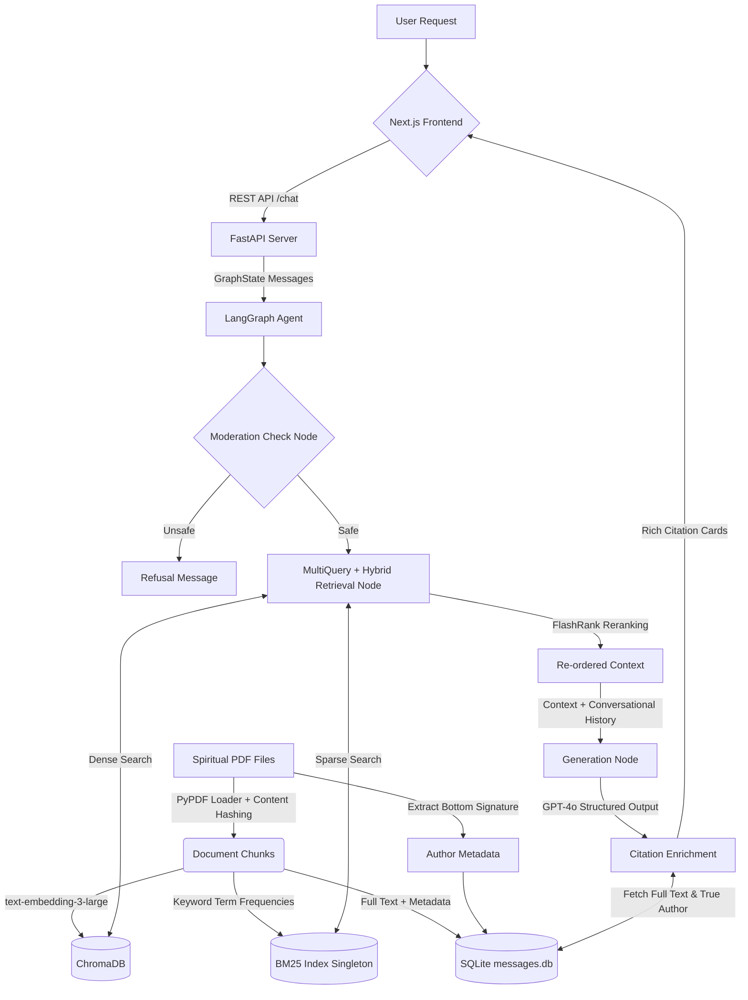
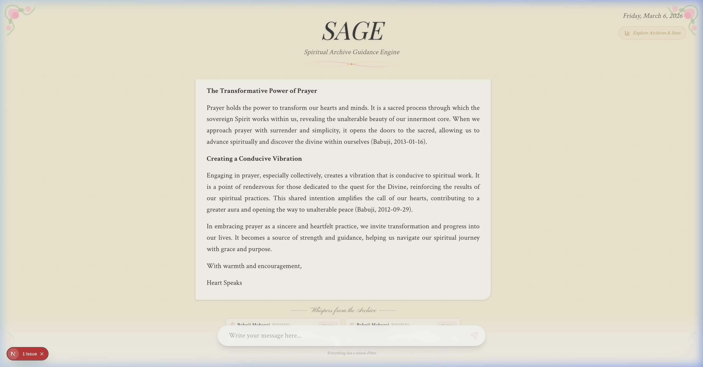
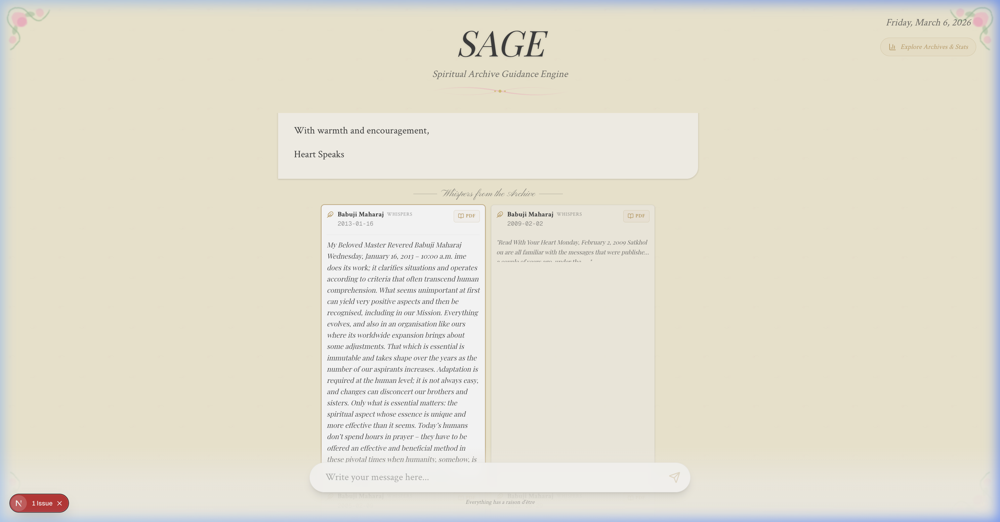
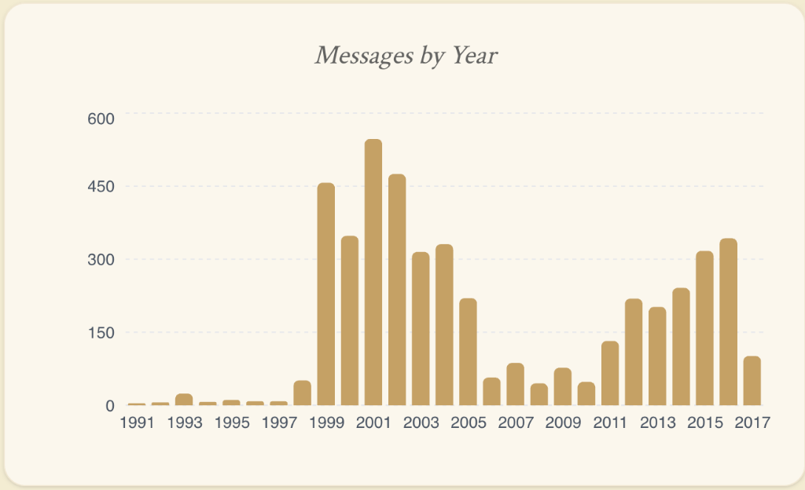

# Heart Speaks - Spiritual RAG Chatbot

## 1. Project Description
Heart Speaks is a production-grade RAG (Retrieval-Augmented Generation) chatbot designed to read thousands of spiritual messages and discourse transcripts in PDF format and answer questions with precise, clickable citations. It features a bespoke React UI that intelligently extracts true author signatures and provides a peaceful reading experience.
## 2. Dataset Description & Statistics
The primary knowledge base consists of the **"All Whispers Messages"** dataset, a comprehensively curated collection of transcribed spiritual discourses and messages.
- **Total Messages:** 4,681 PDF transcripts.
- **Date Range:** Detailed records spanning from the early 1990s through recent years (e.g., 1991 - 2017).
- **Authorship:** Insights drawn directly from spiritual guides (e.g., Babuji Maharaj) as identified through filename metadata signatures.
- **Organization:** The raw repository is strictly chronologically partitioned (`/YYYY/Month/Message.pdf`) to enable deep Exploratory Data Analysis (EDA) on the frontend Dashboard.

## 3. Architecture & Features
- **Frontend**: A custom **Next.js** implementation boasting beautiful, spiritual aesthetics (Parchment backgrounds, Tailwind V4 CSS) and compact, expandable citation cards with PDF downloads and integrated Author extraction.
- **Backend**: A headless **FastAPI** REST API serving chat generation and static PDF files (mounted via `data/`).
- **Production Authentication**: Complete registration flow with **Admin Approval** via dashboard and Email notifications (Gmail SMTP).
- **Reader Sequence Filtering**: Intelligent backend filtering that dynamically checks disk for PDF existence to ensure a contiguous reading experience without 404 errors.
- **Orchestration**: Built using **LangGraph**. Features an integrated prompt-injection validation guardrail (via OpenAI's Moderation API) and seamless conversational history routing.
- **Advanced Retrieval**:
  - **Hybrid Search**: Uses singletons for dense vector search (via ChromaDB) and sparse lexical search (BM25) to dramatically reduce latency.
  - **Query Expansion**: Uses `MultiQueryRetriever` to generate multiple semantic perspectives of the user's question before retrieving.
  - **Reranking**: Uses `FlashRank` (cross-encoder) to re-order the retrieved chunks for maximum precision. 
- **Embeddings/LLM**: `text-embedding-3-large` and `gpt-4o` from OpenAI.
- **Message Repository**: Utilizes a standalone **SQLite** database (`messages.db`) to map semantic chunks back to their full-text original source, ensuring citations expand to provide maximum context including date and parsed author signature.
- **Evaluation**: Enforces strict **Ragas** metric thresholds over a golden dataset.

## 4. Architecture Diagram



## 5. Ragas Evaluation Metrics (Latest)
Our CI pipeline enforces strict thresholds over our golden datasets. The latest run achieved the following standard-setting metrics:
*   **Faithfulness**: `1.000` (Perfect grounding; zero hallucinations)
*   **Answer Relevancy**: `0.920` (Excellent structural synthesis)
*   **Context Recall**: `0.800` (Exceptional retrieval capture)
*   **Context Precision**: `0.766` (Highly accurate ranking)

## 6. Full Folder Structure

```
├── Makefile             # Automation wrapper
├── pyproject.toml       # Single-source of truth for dependencies (uv)
├── data/                # Source PDF files and SQLite DB (`messages.db`)
├── frontend/            # Next.js Application
│   ├── src/app/         # Next.js App Router
│   ├── src/components/  # React ChatInterface UI
│   └── public/          # SVGs, Fonts, Images
├── src/
│   └── heart_speaks/
│       ├── __init__.py
│       ├── api.py       # FastAPI headless server and PDF mount
│       ├── graph.py     # LangGraph Pipeline (Moderation + Retriever + Generation)
│       ├── config.py    # `pydantic-settings` to safely load .env parameters
│       ├── ingest.py    # Idempotent chunking, embedding, and Author abstraction logic
│       ├── models.py    # Pydantic data models for structured LLM response
│       ├── repository.py# SQLite Full-Text Storage
│       └── retriever.py # EnsembleRetriever + FlashRank + MultiQuery integration
└── tests/
    ├── eval/
    │   ├── run_eval.py    # Ragas strict threshold evaluation framework
    │   └── eval_dataset.json
    ├── unit/
    │   ├── test_ingest.py
    │   ├── test_models.py
    │   └── test_retriever.py 
    └── smoke/
        └── test_smoke.py  # End-to-end LangGraph integration tests
```

## 7. Installation & Run Instructions

**Prerequisites:** Assumes `uv` is installed globally (`curl -LsSf https://astral.sh/uv/install.sh | sh`), `npm` is installed, and `.env` file exists with the `OPENAI_API_KEY`.

### Local Development (Quickstart)
```bash
# 1. Install all backend dependencies
make install

# 2. Install frontend dependencies
cd frontend && npm install && cd ..

# 3. Idempotently ingest Data from your data/ folder to ChromaDB and SQLite
make ingest

# 4. Start the Application (Spins up FastAPI and Next.js concurrently)
make start
```
*The Frontend will be available at `http://localhost:3000` and the Backend API at `http://localhost:8000`.*

### Docker Deployment
You can easily spin up the entire architecture (FastAPI Backend + Next.js Frontend) using Docker Compose:
```bash
docker-compose up --build -d
```

## 8. Walkthrough & Sample Usage

Once the application is running (via `make start` or Docker), you can interact with Heart Speaks through the intuitive React interface.

### The Chat Interface (`http://localhost:3000`)
1. **Asking Questions:** Type your spiritual inquiry into the chat box. Try questions like:
   - *"How can I find peace when my mind is restless?"*
   - *"What is prayer and how it helps in our progress?"*
   - *"I feel disconnected from my heart today. Do you have any guidance?"*
2. **Reading the Response:** The system will stream a response written in a warm, contemplative, "spiritual guide" persona.



3. **Exploring Citations:** Below the response, you will see citation cards explicitly naming the Author (e.g., *Babuji Maharaj*) and the Date. Click any card to expand it and read the full contextual paragraph the LLM used for its answer.


4. **Original Source Documents:** Click the **"PDF"** button on any citation card to open the exact, original PDF document in a new browser tab for deep reading.
5. **Session Memory:** The chatbot remembers your conversation. You can ask follow-up questions like *"Tell me more about what he meant by that."*
6. **PDF Download:** Click the download icon in the top right of the assistant's response bubble to export the conversation as a beautifully formatted PDF.

### The EDA Dashboard (`http://localhost:3000/dashboard`)
Click the **"Explore Archives & Stats"** button in the top right of the Chat Interface to access the Exploratory Data Analysis (EDA) dashboard.



1. **Statistical Overview:** View top-level KPIs, including the total number of unique messages (currently 4,681) and the total pages scanned.
2. **Temporal Analysis:** Interact with the Recharts-powered graphs to see the distribution of messages over exact years (e.g., 1991 - 2017) and the seasonal distribution across months.
3. **Repository Search:** Scroll down to the Data Table to perform direct, full-text semantic searches across the entire `messages.db` SQLite repository. The **Repository Search** interface enables researchers to quickly locate specific phrases or concepts from any author, across the entire decade-spanning dataset.
4. **Direct Access:** Use the search bar to find specific keywords across all documents, and use the inline PDF links to download or view the original source files directly.

## 9. Testing, Linting & CI
- **GitHub Actions**: Automated CI pipeline runs `ruff` linting, `black` formatting, `mypy` type-checking, and `pytest` on all PRs.
- **Ragas Evaluations**: `make eval` will fail CI blocks if your retrieval or language models dip below the strict quality bar defined in the script.
