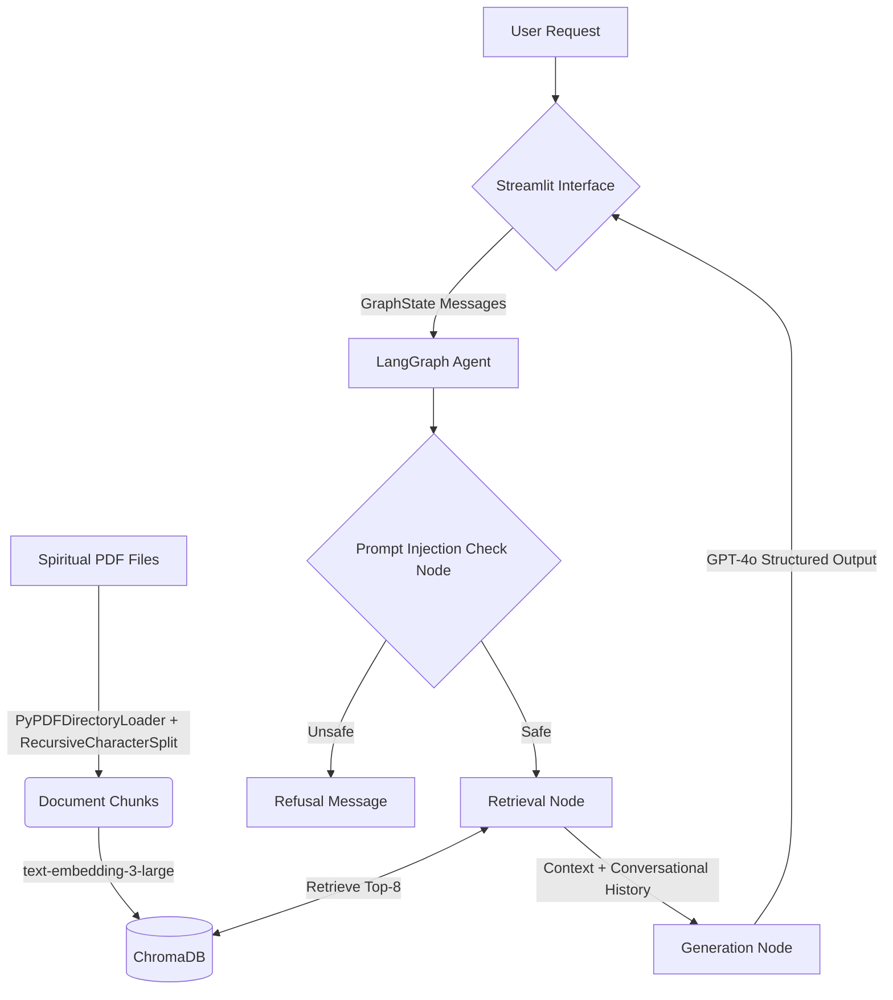

# Heart Speaks - Spiritual RAG Chatbot

## 1. Project Description
Heart Speaks is a RAG (Retrieval-Augmented Generation) chatbot designed to read thousands of spiritual messages and discourse transcripts in PDF format and answer questions with precise citations. 

## 2. Architecture Choices
- **Interface**: Built with Streamlit for a fast and clean chat UI. The sidebar is fully removed for a focused, distraction-free environment.
- **Orchestration**: Built using LangGraph. This offers a substantial upgrade over LCEL, allowing us to build a robust State Graph with integrated prompt-injection validation guardrails and seamless conversational history.
- **Retrieval**: Uses `ChromaDB` running locally for persistent document embeddings. (Configured to fetch the Top-8 chunks). 
- **Embeddings/LLM**: `text-embedding-3-large` and `gpt-4o` from OpenAI to leverage the state-of-the-art context window and reasoning capabilities out-of-the-box.
- **Evaluation**: Ragas and `datasets` integration enables testing the RAG pipeline's Faithfulness and Answer Relevancy over synthetic question loops.
- **Dependency Management**: Uses `uv` for ultra-fast, modern Python package resolution. Configured centrally via `pyproject.toml`.

## 3. Architecture Diagram



## 4. Full Folder Structure

```
├── Makefile             # Automation wrapper
├── pyproject.toml       # Single-source of truth for metadata + dependencies
├── README.md            # You are here
├── data/                # Source PDF files
├── src/
│   └── heart_speaks/
│       ├── __init__.py
│       ├── app.py       # Streamlit Chatbot interface
│       ├── graph.py     # LangGraph Pipeline (Prompt Check + Retriever + Generation)
│       ├── config.py    # `pydantic-settings` to safely load .env parameters
│       ├── ingest.py    # Chunking and embedding logic for PDFs
│       ├── models.py    # Pydantic data models for structured LLM response
│       └── retriever.py # Chroma VectorStore connection
└── tests/
    ├── eval/
    │   └── run_eval.py    # RAGAS evaluation framework and runner
    ├── smoke/
    │   └── test_smoke.py  # End-to-end integration test
    └── logs/              # Location for generated evaluation metrics
```

## 5. Installation & Run Instructions

**Prerequisites:** Assumes `uv` is installed globally (`curl -LsSf https://astral.sh/uv/install.sh | sh`), and `.env` file exists with the `OPENAI_API_KEY`.

```bash
# Install all dependencies and initial setup
make dev

# Ingest Data from your data/ folder to ChromaDB
make ingest

# Run Evaluation using RAGAS to verify standard targets
make eval

# Start the Streamlit App
make run
```

## 6. Test and Evaluation Summary
- **Evaluation Runner:** Located in `tests/eval/run_eval.py`. Evaluates standard spiritual Q&A metrics tracking *Faithfulness* and *Answer Relevancy* using Ragas.
  - Run via: `make eval`
- **Smoke Tests:** Located in `tests/smoke/test_smoke.py`. Performs an end-to-end pipeline creation ensuring the LangGraph agent compiles and runs queries safely without syntax failure.
  - Run via: `make smoke`

## 7. Example Usage
```text
User: How can one achieve inner peace?
Agent: Through meditation, selfless action, and surrendering attachments to the ego.

Sources: 
- Spiritual_Discourse_Jan2023.pdf, Page 14: "Surrendering attachments to the ego is the gateway..."
```

## 8. Development Learnings & Adjustments
- **LangGraph Upgrades**: Integrating `LangGraph` provided significant improvements for incorporating security nodes without cluttering standard LCEL configurations.
- **Robustness**: The move from basic JSON ingestion to robust local PDF parsing (`pypdf` + `cryptography`) allows tracking of source filenames and granular page locations for deeper contextual citations.
