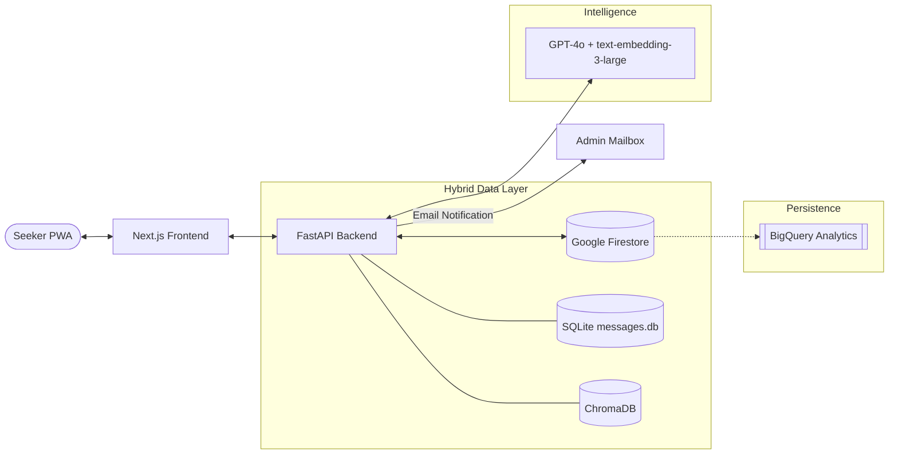

# SAGE: Spiritual Archive Guidance Engine 🕊️

> **"Heart Speaks to Heart in the Sanctuary of Silence."**

SAGE is a state-of-the-art **Retrieval-Augmented Generation (RAG)** ecosystem designed to preserve and provide intelligent access to thousands of spiritual discourses. It transforms a vast archive of 4,600+ PDF transcripts into a living, conversational companion, now powered by a **Hybrid Persistent Architecture** (Firestore + SQLite) for seamless cross-device synchronization.

---

## 🌐 Live Production Access

The SAGE Sanctuary is fully deployed and operational on GCP:

*   **Sanctum (Frontend):** [https://sage-frontend-34833003999.europe-west2.run.app](https://sage-frontend-34833003999.europe-west2.run.app)
*   **Oracle (Backend API):** [https://sage-backend-34833003999.europe-west2.run.app](https://sage-backend-34833003999.europe-west2.run.app)

---

## 🏗️ Technical Architecture

SAGE uses a hybrid storage model to balance high-speed retrieval with persistent user data across multiple devices.

### System Flow Diagram



### Hashing & Data Integrity
*   **Hybrid Storage**: Read-only messages are stored in a bundled SQLite database for speed. All user-specific data (bookmarks, progress, chat logs) is stored in **Firestore** for persistence across Cloud Run deployments.
*   **Security**: Uses `pbkdf2_sha256` for secure password hashing and JWT for session management.
*   **Auditability**: Chat logs are denormalized with user details and stored in Firestore, ready for BigQuery analysis.

---

## ✨ Core Features

### 1. The Sanctuary — Persona-Driven Chat
SAGE adapts its persona based on the seeker's intent:
*   **Wisdom Seeking**: Meditative, thematic depth with structured subheadings.
*   **Emotional Support**: Compassionate, letter-style guidance.
*   **Factual Reference**: Concise citations with exact dates and sources.

### 2. The Archives — Reader with Sync
*   **Persistence**: Reading progress (saved message/page) is synced across your phone and web.
*   **Auto-Save**: Personal notes taken during reading are instantly saved to Firestore.

### 3. Admin Command Center
*   **Registration Gating**: All new registrations require admin approval.
*   **Admin Dashboard**: Approve, Reject, **Suspend**, or **Permanently Delete** users.
*   **Cascade Deletion**: Highly secure data removal—deleting a user erases all their associated Firestore data (bookmarks, etc.) instantly.
*   **Notifications**: Admins receive real-time email alerts for every registration request.

---

## 📂 Organization Structure

```text
.
├── All_Whispers_message/      # 4,600+ PDF transcripts
├── chroma_db/                 # Vector Store used by RAG
├── src/
│   └── heart_speaks/
│       ├── api.py             # FastAPI Service Layer
│       ├── auth.py            # Firestore Auth & User Management
│       ├── repository.py      # Hybrid Data Repository
│       ├── graph.py           # LangGraph RAG Logic
│       ├── firestore_db.py    # Cloud Firestore Client
│       └── config.py          # Pydantic Settings & Environment
├── frontend/
│   ├── src/
│   │   ├── app/               # Next.js Pages (Sanctuary, Reader, Admin)
│   │   ├── components/        # Glassmorphic UI Components
│   │   └── lib/               # Auth client & API Interceptors
├── tests/
│   ├── test_firestore_auth.py       # User logic unit tests
│   └── test_firestore_repository.py # Repository integration tests
├── Dockerfile                 # Multi-stage Backend Container
└── pyproject.toml             # Python Project Dependencies
```

---

## 🚀 Deployment & Infrastructure

Deployed using a CI/CD pipeline targeting **Google Cloud Platform**:

| Component | Technology | Role |
| :--- | :--- | :--- |
| **Compute** | Cloud Run | Auto-scaling serverless containers for FE/BE |
| **Database** | Cloud Firestore | Persistent seeker data & metadata |
| **Retriever** | ChromaDB + BM25 | Hybrid semantic/lexical search stack |
| **Secrets** | Secret Manager | Secure storage for API keys and SMTP credentials |
| **CI/CD** | Cloud Build | Parallelized containerization and deployment |
| **Monitoring** | Cloud Logging | Real-time audit trails and error tracking |

---

## 🛠️ Local Development

**Prerequisites:** `uv`, `npm`, and an `.env` file containing `OPENAI_API_KEY`, `JWT_SECRET_KEY`, and `GMAIL_APP_PASSWORD`.

```bash
# 1. Install dependencies
make install
cd frontend && npm install && cd ..

# 2. Start the ecosystem
make start
# http://localhost:3000 -> Sanctuary
# http://localhost:8000 -> API Docs
```

---

## 🧪 Testing & Validation

*   **Ragas Evals:** Faithfulness score of **1.000**.
*   **Coverage**: Comprehensive mocked tests verify Firestore interactions without requiring an emulator.
*   **Security**: Admin roles enforced at the API level via FastAPI dependencies.

*Peace and Silence.* 🕊️
