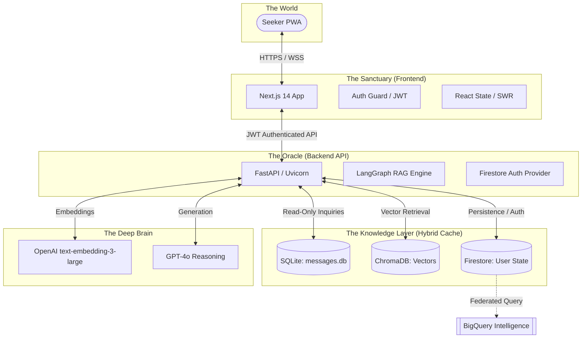

<div align="center">
 


# SAGE: Spiritual Archive Guidance Engine
### *The Oracle in the Cloud. The Sanctuary in your Pocket.*

[](https://sage-frontend-34833003999.europe-west2.run.app)
[](https://github.com/vaibhavd030/Heart_speaks)
[](https://openai.com)

</div>

---

## 🕊️ Divine Vision

SAGE is not just a search engine; it is a **digitized sanctuary**. It transforms a vast, static archive of 4,600+ spiritual PDF transcripts into a living, breathing conversational companion. By leveraging state-of-the-art **Hybrid Retrieval-Augmented Generation (RAG)**, SAGE provides seekers with precise, citation-backed guidance, preserving the sanctity of original teachings while making them accessible in the modern digital age.

---

## 🌐 Live Production Access

The SAGE Sanctuary is fully deployed and operational:

*   **SAGE Sanctum:** [https://sage-frontend-34833003999.europe-west2.run.app](https://sage-frontend-34833003999.europe-west2.run.app)

---

## ✨ Elite Seeker Experience

### 1. The Sanctuary (Intelligent Chat)
A deeply adaptive conversational interface that recognizes the seeker's state of mind.
*   **Intent-Aware Personas:** SAGE dynamically shifts its tone—from scholarly and precise to supportively compassionate—based on the nature of your inquiry.
*   **Translucent Citations:** Every response is anchored in reality. Expandable citation cards show you the exact whisper used by the AI, with direct links to the original PDF source.
*   **Streaming Oracle:** Experience thought in real-time with high-speed token streaming for a natural, meditative flow.

### 2. The Great Archives (Synced Reader)
A focused environment for sequential study of the masters' words.
*   **Temporal Navigation:** Traverse decades of wisdom chronologically with a high-performance pagination engine.
*   **Universal Persistence:** Start reading on your phone during a commute and pick up on the exact same line on your desktop. Reading progress is synced to the **Cloud Firestore** backbone.
*   **Integrated Reflections:** Capture insights directly within the reader. Your notes are auto-saved and tied to your account across all devices.

### 3. Personal Library (Bookmarks)
A curated collection of the whispers that resonate most with your soul.
*   **One-Touch Preservation:** Bookmark any message or chat response for future contemplation.
*   **Account-Linked:** Your library is private, secure, and available anywhere you log in.

---

## 🏗️ High-Fidelity Architecture

SAGE employs a sophisticated **Hybrid Storage & Retrieval** strategy to ensure high-speed performance without sacrificing data durability.

### The Macro System Map



### Technical Specifications

| Component | Intelligence | Implementation Details |
| :--- | :--- | :--- |
| **Retriever** | Hybrid Ensemble | 60% Dense (Semantic) + 40% Sparse (BM25 Lexical) |
| **Pipeline** | LangGraph | Multi-step reasoning: Safety -> Intent -> Expansion -> Rank -> Render |
| **Persistence** | Firestore | Real-time seeker data: Progress, Bookmarks, and Chat Sessions |
| **Cache Layer** | SQLite | 14,000+ cached metadata entries for hyper-fast message lookup |
| **Security** | JWT + PBKDF2 | Industry-standard auth with server-side admin approval gating |

---

## 🔐 Admin Command Center

Designed for the stewards of the archive, the Admin Panel provides complete control over the sanctuary's integrity.
*   **Gated Entry**: Every seeker must be vetted. Admins receive real-time email alerts via Gmail SMTP for every registration request.
*   **Seeker Lifecycle**: Approve, Reject, **Suspend**, or **Permanently Delete** users with one click.
*   **Cascade Privacy**: Deleting a user account triggers an atomic cascade that erases all their personal Firestore data (bookmarks, reading history) instantly.
*   **Audit Trails**: Detailed chat logs allow admins to monitor the system's guidance and ensure quality.

---

## 📂 Elite Repository Organization

```text
.
├── src/heart_speaks/
│   ├── api.py           # The Gateway: FastAPI endpoints and CORS logic
│   ├── auth.py          # The Gatekeeper: Firestore-backed JWT Auth system
│   ├── graph.py         # The Brain: LangGraph implementation of the RAG pipeline
│   ├── repository.py    # The Librarian: Hybrid logic for SQLite and Firestore
│   ├── retriever.py     # The Seeker: Ensemble retrieval (Chroma + BM25)
│   └── firestore_db.py  # The Conduit: Singleton Firestore client
├── frontend/src/
│   ├── app/             # Modern App Router pages (Reader, Dashboard, Sanctuary)
│   ├── components/      # Glassmorphic UI & Seeker Components
│   └── lib/             # Elite API client with interceptors
├── tests/               # Professional Suite: Mocked Firestore unit tests
├── All_Whispers_message/# The Source: Compressed PDF archive (4,600+ docs)
└── pyproject.toml       # The Blueprint: Unified project dependencies
```

---

## 🚀 Production Infrastructure (GCP)

SAGE is natively built for the **Google Cloud** ecosystem, ensuring global availability and infinite scalability.

*   **Cloud Run**: Serverless compute for the Frontend and Backend, auto-scaling to zero to save costs.
*   **Cloud Firestore**: NoSQL persistence for all mutable seeker data.
*   **Secret Manager**: Military-grade rotation for OpenAI keys, JWT secrets, and SMTP credentials.
*   **Cloud Build**: Automated CI/CD pipeline building multi-stage optimized Docker images.

---

## 🛠️ Developer Manifest

### Local Setup
Ensure you have `uv` and `npm` installed.

1.  **Environment**: Populate `.env` with `OPENAI_API_KEY`, `JWT_SECRET_KEY`, and `GMAIL_APP_PASSWORD`.
2.  **Install**: `make install && cd frontend && npm install && cd ..`
3.  **Sanctify**: `make ingest` (processes PDFs and hydrates Vector Store).
4.  **Awaken**: `make start` (runs both Backend and Frontend).

---

*Peace and Silence.* 🕊️
