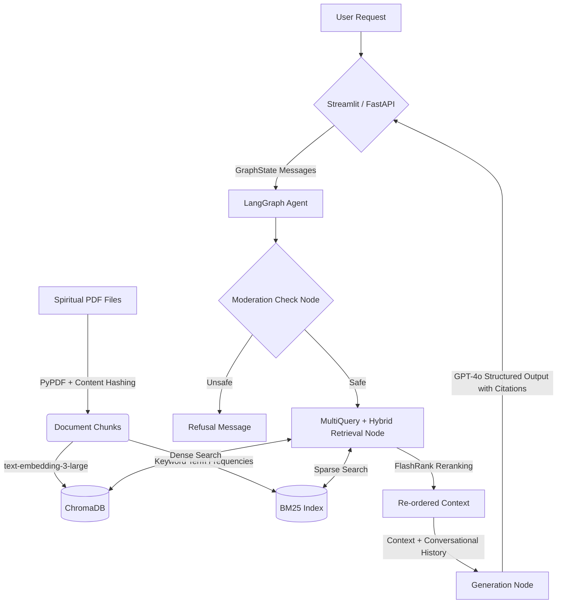

# Heart Speaks - Spiritual RAG Chatbot

## 1. Project Description
Heart Speaks is a production-grade RAG (Retrieval-Augmented Generation) chatbot designed to read thousands of spiritual messages and discourse transcripts in PDF format and answer questions with precise citations. 

## 2. Architecture & Features
- **Dual Interfaces**: 
  - **Next.js Frontend**: A beautiful, bespoke ChatUI with expanding full-text citation sources.
  - **FastAPI**: A headless REST API (`/chat`) for remote integrations, with metadata filtering and session state support.
- **Orchestration**: Built using **LangGraph**. Features an integrated prompt-injection validation guardrail (via OpenAI's Moderation API) and seamless conversational history routing.
- **Advanced Retrieval**:
  - **Hybrid Search**: Uses `EnsembleRetriever` combining dense vector search (via ChromaDB) and sparse lexical search (BM25).
  - **Query Expansion**: Uses `MultiQueryRetriever` to generate multiple semantic perspectives of the user's question before retrieving.
  - **Reranking**: Uses `FlashRank` (cross-encoder) to re-order the retrieved chunks for maximum precision. 
- **Embeddings/LLM**: `text-embedding-3-large` and `gpt-4o` from OpenAI.
- **Semantic Caching**: Integrated `SQLiteCache` saves latency and tokens on repeated identical queries.
- **Idempotent Ingestion**: Content hashing prevents duplicate chunks when running ingestion multiple times.
- **Evaluation**: Enforces strict `Ragas` metric thresholds (Context Precision > 0.80, Context Recall > 0.75, Faithfulness > 0.85, Answer Relevancy > 0.80) over a golden dataset.
- **Dependency Management**: Uses `uv` for ultra-fast, strictly pinned Python package resolution.

## 3. Architecture Diagram



## 4. Full Folder Structure

```
├── Makefile             # Automation wrapper
├── pyproject.toml       # Single-source of truth for dependencies (uv)
├── Dockerfile           # Multi-stage container build
├── docker-compose.yml   # Orchestration for containers & persistent volumes
├── data/                # Source PDF files
├── src/
│   └── heart_speaks/
│       ├── __init__.py
│       ├── app.py       # Streamlit Chatbot interface
│       ├── api.py       # FastAPI headless server
│       ├── graph.py     # LangGraph Pipeline (Moderation + Retriever + Generation)
│       ├── config.py    # `pydantic-settings` to safely load .env parameters
│       ├── ingest.py    # Idempotent chunking and embedding logic
│       ├── models.py    # Pydantic data models for structured LLM response
│       └── retriever.py # EnsembleRetriever + FlashRank + MultiQuery integration
└── tests/
    ├── eval/
    │   ├── run_eval.py    # RAGAS strict threshold evaluation framework
    │   └── eval_dataset.json
    ├── unit/
    │   ├── test_ingest.py
    │   ├── test_models.py
    │   └── test_retriever.py 
    └── smoke/
        └── test_smoke.py  # End-to-end integration test
```

## 5. Installation & Run Instructions

**Prerequisites:** Assumes `uv` is installed globally (`curl -LsSf https://astral.sh/uv/install.sh | sh`), and `.env` file exists with the `OPENAI_API_KEY`.

### Local Development
```bash
# Install all Python backend dependencies
make dev

# Idempotently ingest Data from your data/ folder to ChromaDB and SQLite
make ingest

# Run Pytest unit tests
uv run pytest tests/unit/ -v

# Run Evaluation using RAGAS to verify quality thresholds
make eval

# Start the FastAPI Backend
PYTHONPATH=src uv run uvicorn heart_speaks.api:app --host 0.0.0.0 --port 8000

# Start the Streamlit App (Alternative Frontend)
uv run streamlit run src/heart_speaks/app.py

# In a new terminal, start the Next.js Frontend
cd frontend
npm install
npm run dev
```

### Docker Deployment
```bash
docker-compose up --build -d
```

## 6. Testing, Linting & CI
- **GitHub Actions**: Automated CI pipeline runs `ruff` linting, `black` formatting, `mypy` type-checking, and `pytest` on all PRs.
- **Ragas Evaluations**: `make eval` will `sys.exit(1)` and purposefully fail CI blocks if your retrieval or language models dip below the strict quality bar defined in the script.

## 7. Example Usage
```text
User: How can one achieve inner peace?
Agent: Through meditation, selfless action, and surrendering attachments to the ego.

Sources: 
- Spiritual_Discourse_Jan2023.pdf, Page 14: "Surrendering attachments to the ego is the gateway..."
```
